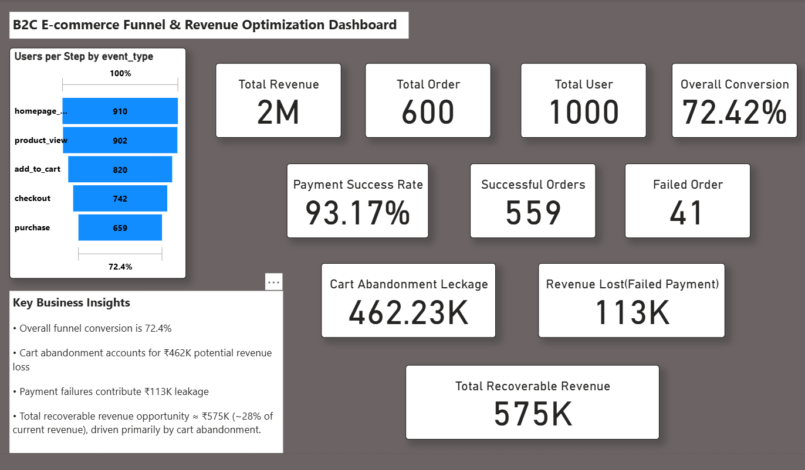

# 🛒 B2C E-commerce Funnel & Revenue Optimization Analysis

## 📌 Project Overview

This project analyzes user behavior across a simulated B2C e-commerce funnel to identify revenue leakage and optimization opportunities. The analysis was performed using MySQL for data validation and Power BI for dashboard visualization and business insights.

---

## 🎯 Objective

- Analyze customer journey from homepage to purchase.
- Measure funnel conversion performance.
- Identify revenue leakage from cart abandonment and failed payments.
- Quantify recoverable revenue opportunities.

---

## 🗂 Dataset Schema

The relational data model consists of:

- **users** – user demographics and device information  
- **sessions** – session-level tracking  
- **events** – user interaction events (homepage, product, cart, checkout, purchase)  
- **orders** – order value and payment status  

Primary and foreign keys were implemented to maintain referential integrity.

---

## 📊 Key Analysis Performed

### 1️⃣ Funnel Analysis
- Counted distinct users at each funnel stage.
- Calculated overall funnel conversion rate.

### 2️⃣ Device-Level Analysis
- Compared funnel behavior across Mobile vs Desktop.
- Measured revenue contribution by device.

### 3️⃣ Payment Performance
- Calculated payment success rate.
- Identified failed payment impact.

### 4️⃣ Revenue Leakage Estimation
- Estimated cart abandonment revenue loss.
- Calculated revenue loss from failed payments.
- Quantified total recoverable revenue opportunity.

---

## 📈 Key Insights

- Overall funnel conversion rate: **72.4%**
- Payment success rate: **93.17%**
- Cart abandonment leakage: **₹462K**
- Failed payment leakage: **₹113K**
- Total recoverable revenue opportunity: **₹575K (~28% of current revenue)**

---

## 💡 Business Recommendations

- Optimize cart-to-checkout transition to reduce drop-offs.
- Investigate payment failure causes to improve transaction success.
- Prioritize mobile checkout experience improvements due to higher traffic share.

---

## 🛠 Tools Used

- MySQL (Data modeling & analysis)
- Power BI (Dashboard & DAX calculations)

---

## 📷 Dashboard Preview

